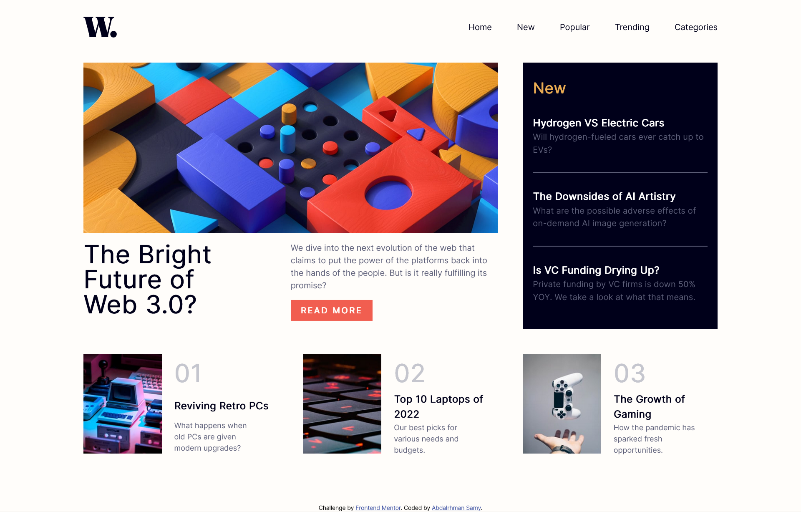
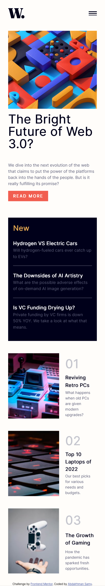

# News Homepage &rarr; [LIVE](https://fementor-news.netlify.app/)

Based on the design provided for Frontend Mentor's **[News Homepage](https://www.frontendmentor.io/challenges/news-homepage-H6SWTa1MFl)** Challenge.

## What I Learned

- The BEM naming methodology is kinda confusing when it comes to nesting, but it's probably one of the best things I've learned lately. Will definitly keep using it in all my projects.

- Dividing CSS files into different parts makes life easier, will also keep doing it in other projects.

- Turns out you don't really need to use JS to do the mobile menu, it can be done with only a checkbox (I did it with JS however)

## Screenshots

### Desktop

   

### Phones
   

