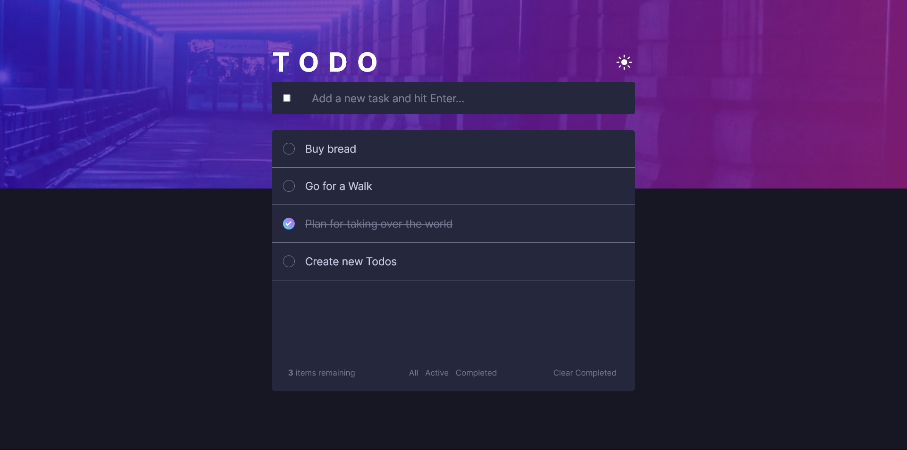
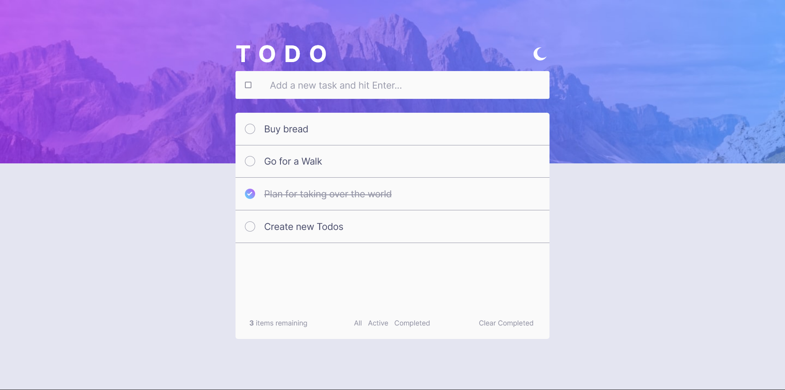
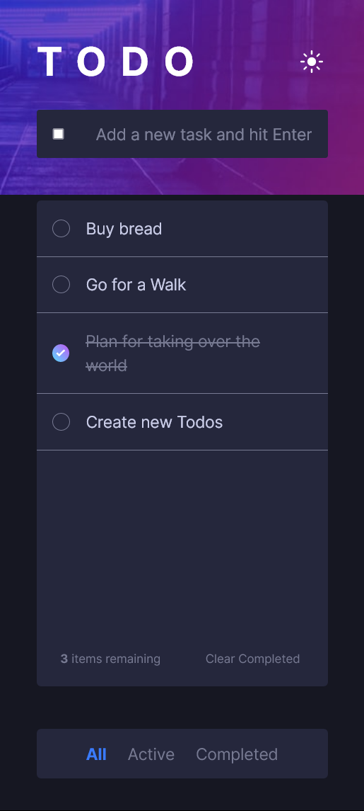

# TODO App &rarr; [LIVE](https://fe-mentor-todo.netlify.app/)

Based on the design provided for Frontend Mentor's **[TODO App](https://www.frontendmentor.io/challenges/todo-app-Su1_KokOW)** Challenge.

I hate how Frontend Mentor names the colors provided ('light grayish blue' should be something like 'background color').

## What I Learned

- BEM again! ~~I no longer like it as much lol~~

- CSS variables and creating a dark theme using them.

- Thinking in 'React' also helped me deal with a few problems such as re-rendering new data (not perfect but works) 

- ~~I absloutely hate having to write styles from scratch, it's easy but incredibly boring~~

## Screenshots

### Desktop (Dark theme)

### Desktop (Light theme)

---

### Phones (Dark theme)
   

### Phones (Light theme)
   

